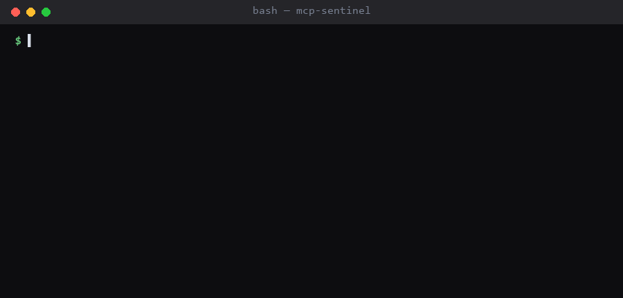

# mcp-audit

[](https://github.com/YashkantG/mcp-audit/actions/workflows/ci.yml)
[](#show-your-posture)
[](https://pypi.org/project/mcp-audit/)
[](LICENSE)
[](pyproject.toml)

**Audit an MCP server before you let an agent near it.**



Connecting an agent to a Model Context Protocol server hands that server two
things at once: **code execution on your machine**, and **a direct line to the
model's context**. The second one is what makes MCP different from an ordinary
dependency.

A tool's `description` field isn't documentation for humans — it's fed
straight to the LLM as instructions. A server author (or someone who
compromised one) can write a description that tells your agent to do something
you never asked for, and you'd never see it in a code review that only looked
at the implementation. That's a new class of supply-chain risk, and there are
now [20,000+ MCP servers](https://mcp.so) in public directories with almost no
security review between them and your agent.

`mcp-audit` is a fast, local, dependency-light first pass over any MCP
server — one you didn't write, or one you're about to publish.

---

## Quick start

Audit a server you're thinking about trusting:

```bash
pip install mcp-audit

git clone https://github.com/some-org/some-mcp-server
mcp-audit scan ./some-mcp-server
```

That's the whole workflow. No account, no config file, no network calls — see
[Runs entirely on your machine](#runs-entirely-on-your-machine).

## What it catches

- 🧠 **Prompt-injection-prone tool descriptions** — phrasing aimed at the
  calling model rather than at a human reader ("ignore previous instructions",
  "do not tell the user"), hidden zero-width unicode, and descriptions long
  enough to bury instructions in. Checked in static JSON manifests **and** in
  the source-embedded string literals where real servers actually keep them.
- 🔓 **Over-broad capabilities** — tools advertising shell/exec/arbitrary file
  access, or accepting unvalidated free-form input (`additionalProperties: true`).
- 💣 **Dangerous code paths** in the implementation — `eval`,
  `subprocess(..., shell=True)`, `os.system`, `pickle.loads`, unsafe `yaml.load`.
- 🔑 **Hardcoded secrets** — API keys, AWS keys, GitHub/Slack tokens committed
  into source or config.
- 🌐 **Unsafe defaults** — binding to `0.0.0.0`, `trust` / `skip_auth` flags
  left on.

Full [rule reference](#rules) below. Every rule ID is stable — see the
[rule stability policy](CHANGELOG.md#rule-stability-policy) before you pin one
in CI.

## Use it in CI

**GitHub Action** — no `pip install` boilerplate:

```yaml
- uses: YashkantG/mcp-audit@main
  with:
    path: ./my-mcp-server
    fail-on: high
```

**SARIF → GitHub Code Scanning**, so findings land in the Security tab instead
of scrolling past in a build log:

```yaml
- uses: YashkantG/mcp-audit@main
  with:
    path: ./my-mcp-server
    format: sarif
    upload-sarif: "true"
```

**pre-commit**:

```yaml
repos:
  - repo: https://github.com/YashkantG/mcp-audit
    rev: v0.3.0
    hooks:
      - id: mcp-audit
```

**Any other CI** — `mcp-audit scan . --fail-on high` exits non-zero when it
finds something at or above that severity. `--format json` for machine-readable
output.

## Show your posture

If you publish an MCP server, `--format badge` emits a
[shields.io endpoint](https://shields.io/badges/endpoint-badge) payload you can
commit and display, so the people evaluating your server can see it was
checked:

```bash
mcp-audit scan . --format badge > .github/badges/mcp-security.json
```

```markdown
[](https://github.com/YashkantG/mcp-audit)
```

Grades are deliberately blunt: **A** clean, **B/C** medium findings, **D/F**
high findings. The badge at the top of this README is this repo scanning
itself, regenerated and verified on every CI run.

## Tuning it

A pattern-based scanner will flag things you've already reviewed. Three levers,
narrowest first:

**Inline**, on the offending line:

```python
subprocess.run(cmd, shell=True)  # mcp-audit: ignore[MCP102]
subprocess.run(cmd, shell=True)  # mcp-audit: ignore        ← all rules, this line
```

**Project config** — `.mcpaudit.toml` at the scan root:

```toml
[ignore]
rules = ["MCP004"]              # repo-wide
paths = ["tests/fixtures/**"]

[severity]
MCP003 = "LOW"                  # downgrade rather than silence

[[custom_rules]]                # your own checks, no fork required
id = "CUSTOM001"
pattern = "InternalOnlyApi\\.execute"
message = "Internal-only API called from an MCP tool handler"
severity = "HIGH"
```

**CLI**, for one-offs: `mcp-audit scan . --ignore-rule MCP004`

This repo's own [`.mcpaudit.toml`](.mcpaudit.toml) is a worked example.

## Runs entirely on your machine

`mcp-audit` makes **zero network calls**. It doesn't phone home, doesn't
upload your code, and has no telemetry. Runtime dependencies are `typer`,
`rich`, and `tomli` (Python < 3.11 only).

Releases publish through
[PyPI Trusted Publishing](https://docs.pypi.org/trusted-publishers/) (OIDC — no
long-lived tokens), so every release traces back to the GitHub Actions run that
built it. If your security team needs to approve a new tool: read the source,
then run it with no network access at all. It doesn't need any.

Reporting a vulnerability — in this tool, or one you found *with* it — see
[SECURITY.md](SECURITY.md).

## Rules

| ID | Check |
|----|-------|
| MCP001 | Prompt-injection phrasing in tool description |
| MCP002 | Hidden/invisible unicode characters in tool description |
| MCP003 | Suspiciously long tool description (payload smuggling risk) |
| MCP004 | Over-broad capability exposed by tool name/description |
| MCP005 | Tool schema accepts arbitrary/unvalidated input |
| MCP101 | Dangerous code execution sink (`eval`, `exec`, `new Function`) |
| MCP102 | Shell command built from untrusted input |
| MCP103 | Unsafe deserialization (`pickle.loads`, unsafe `yaml.load`) |
| MCP201 | Hardcoded secret or credential |
| MCP301 | Server bound to all network interfaces |
| MCP302 | Authentication / trust check disabled |

Plus any `[[custom_rules]]` you define.

## Design

Deliberately pattern/regex-based rather than a full taint-tracking analyser.
That's a real tradeoff, stated plainly:

- **You get**: sub-second scans, a rule set you can read end-to-end in one
  sitting, no compilation or language runtime per target, trivial extensibility.
- **You give up**: certainty. It cannot tell you whether attacker-controlled
  data actually reaches a `shell=True` call. It is a first pass that tells you
  where a human should look — not a proof of safety, and it makes no soundness
  claim.

Anyone selling you a scanner that claims to be complete is selling you
something else.

## Contributing

Issues and PRs welcome, especially new rules, more language coverage (Python /
JS / TS today), and real-world servers that break it. See
[CONTRIBUTING.md](CONTRIBUTING.md) for setup and the fixture-pair pattern every
rule follows, or pick up a
[good first issue](https://github.com/YashkantG/mcp-audit/labels/good%20first%20issue).

False positives are treated as real bugs — [report them](https://github.com/YashkantG/mcp-audit/issues/new/choose).

## License

MIT — see [LICENSE](LICENSE).
